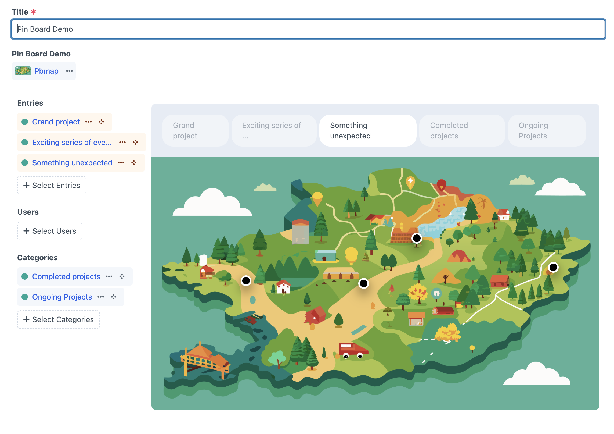
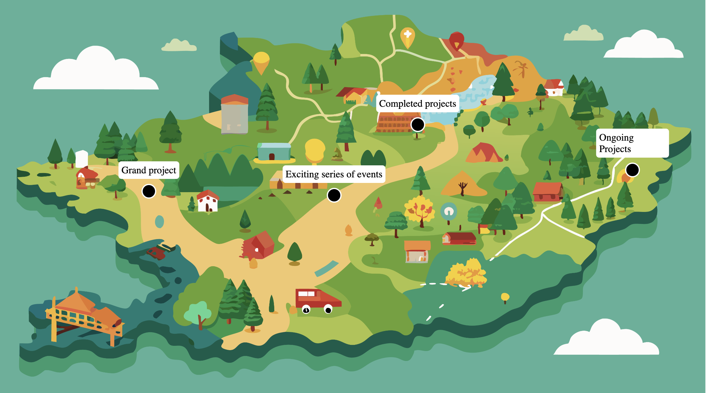

# Craft Pinboard Plugin

A flexible Craft CMS fieldtype which allows content editors to create and manage interactive images for location maps, product callouts, feature callouts and more.

### Field configuration screenshot


### Content editor interface screenshot


### Front end example screenshot


## Features

- Create and manage interactive images
- Add multiple pins to an image
- Easy to use drag and drop interface
- Add pins for multiple element types to a single image
- Easily see which elements are pinned and which are not via the pin palette
- Simple to use on the front end

## Coming Soon

- Front end javascript helpers to make it even easier to use on the front end
- Front end twig helpers to make it even easier to use on the front end


## Example Front End Usage

```twig
<div class="backdrop">
	.backdrop.url }}"/>
	
  {# loop over our pins, setting their top and left CSS attributes to position them #}
  

		{% set pinStyle = "top:" ~ pin.y ~ "%; left:" ~ pin.x ~ "%; ;transform: translate(-50%, -50%)" %}
		{% set labelStyle = "top:" ~ pin.y ~ "%; left:" ~ pin.x ~ "%; ;transform: translate(-50%, calc(-100% + -20px))" %}

		<div class="pin" style="{{pinStyle}}"></div>
		<div class="pinLabel" style="{{labelStyle}}">
			{{ pin.title }}
		</div>
	
</div>


<!-- You'll usually place your styles in a seperate file but this works for a demo -->
<style>

	.backdrop {
		width: 80%;
		position: relative;
	}

  {# it is important to set the image with to no more than 100% #}
	.backdrop img {
		width: 100%;
		max-width: 100%;
		height: auto;
	}

	.pin {
		position: absolute;
		width: 20px;
		height: 20px;
		background-color: black;
		border: 2px solid white;
		border-radius: 50%;
	}

	.pinLabel {
		position: absolute;
		background-color: white;
		padding: 5px;
		border-radius: 5px;
	}
</style>

```